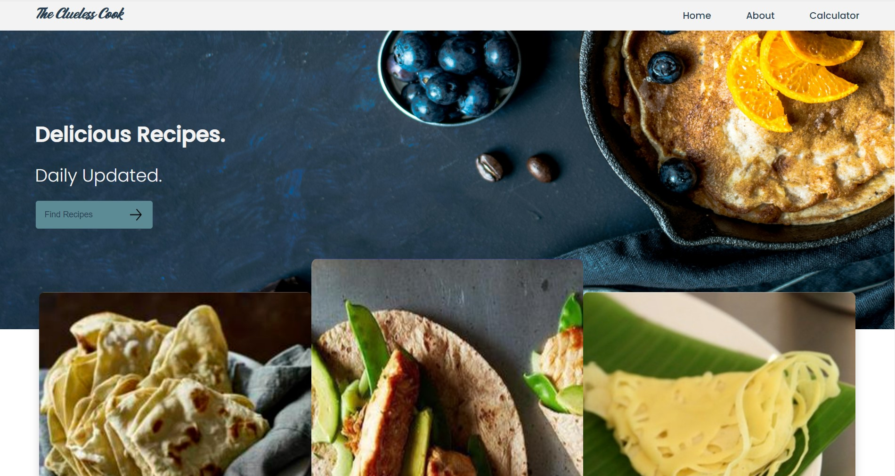
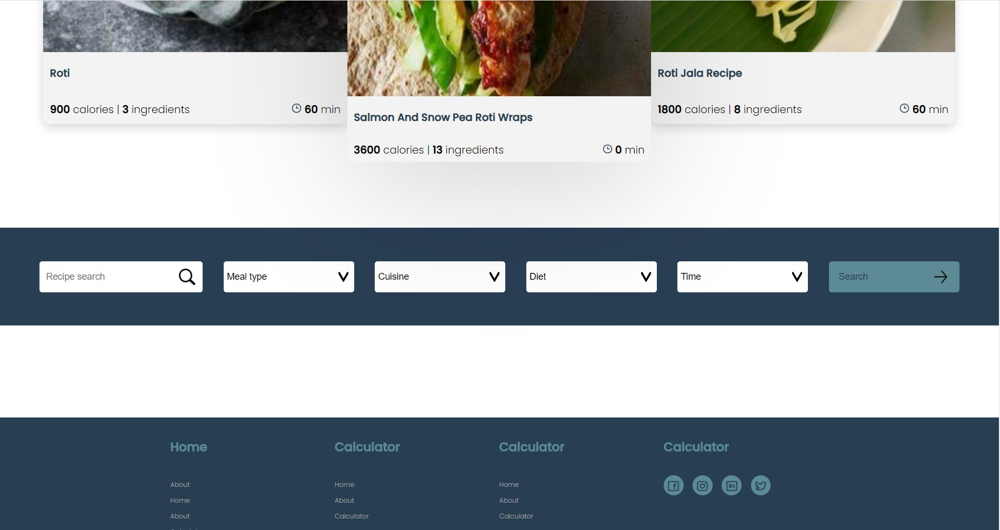

#The Clueless Cook - Recipe finder app

###Find nutrition info by searching a recipe, product or barcode

##Table of contents

* [General info](#general-info)
* [Link]((#link))
* [Screenshots](#screenshots)
* [Technologies](#technologies)
* [Setup](#setup)
* [Status](#status)
* [Features](#features)
* [Future updates](#future-updates)
* [Code Example](#code-example)
* [Sources](#sources)
* [Inspiration](#inspiration)
* [Author](#author)
* [Contributions](#contributions)

##General info

This app is a simple calorie finder and calculator.
It's a three-page website where you can also find recipes.
The instructions for making the recipe aren't in the website.
But there are links to the directions on other sites.

##Link
You can find the
[Github repo of the app here.](https://github.com/Originilala/eindopdracht)
##Screenshots


##Technologies
* parcel: version 2.6.1
* npm: version 8.12.2
* axios: verion 0.27.2
##Setup
_Here is a step-by-step plan for creating the application._

1. Clone the app and download to your pc.
2. Now you can install the node modules. 

> npm install

3.Then a folder called 'notes' must be created in the main folder. A javascript file can be created here called appkey.js.
4. In this file, 1 object must be exported. This object is called secretKeys and has 6 key-value pairs.
5. The keys are nutKey, nutID, fooKey, fooID, recKey and recID with the corresponding API key values that you can request at Edamam.com by signing up.
6. Now you can run the app.

> npm run start 

##Status

This app is finished, but may be enhanced with more features in the near future.

##Features

- The app searches through the database to find recipe nutrition info.
- There is also a link included to the instructions for making recipes.
- Calories can be calculated per portion.

##Future updates
_Finally, suggestions for its evolution._

- [x] Add about page
- [ ] Add authentication
- [ ] Add storage for computed calories per user
- [ ] Add graphs for visualizing calorie intake
- [ ] Add camera bar code scanner for a simple calorie count 

##Code Example
```
headerAnim.addEventListener("click", navigateToNextPage, true);
function navigateToNextPage(e) {
    if (e.target.getAttribute('href') && e.target.tagName === "A") {
        e.preventDefault();
            headerAnim.removeAttribute('class');
            setTimeout(() => {
                window.location.replace(`${e.target.getAttribute('href')}`)
            }, 2000)
    }
}
```
##Sources
* API is provided by Edamam.com
* Screen designs are provided by Novi.nl
##Inspiration
* 24kitchen.nl
##Author
**Originilala**

[Repos](https://github.com/Originilala)

##Contributions

Are welcome